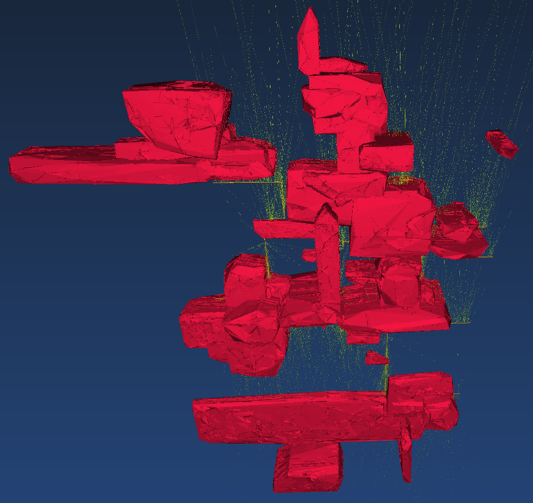

# Synthetic Mine Maker
A synthetic dataset generator for 3D mines

Producing synthetic data is important for demos, scientific papers, and
to evaluate code performance and correctness without relying on confidential
data that's often hard to obtain (and impossible to share).
Synthetic Mine Maker produces synthetic data that mimics spatial features seen
in real-life 3D mines, including support for:

- Multiple levels
- Drill holes
- Geological shapes
- Block models

Generating a new dataset is as simple as running `./geometry-maker`. Settings
can be changed by modifying `config.ini`.

Drill hole lengths and shape sizes follow statistical distributions that
mimics reality thanks to a detailed characterization of several real-world
mining complexes. Other features such as the layout of the mine level are
generated according to an uniform distribution and user-defined thresholds.

# Output

The output is comprised of a set of PostgreSQL dump files that can be
ingested into an existing database using the standard `psql` tool. It is
also possible to export the geometries into plain WKT files with `--output-type=wkt`.
When loaded into a third-party 3D renderer, a typical scene looks like this:

